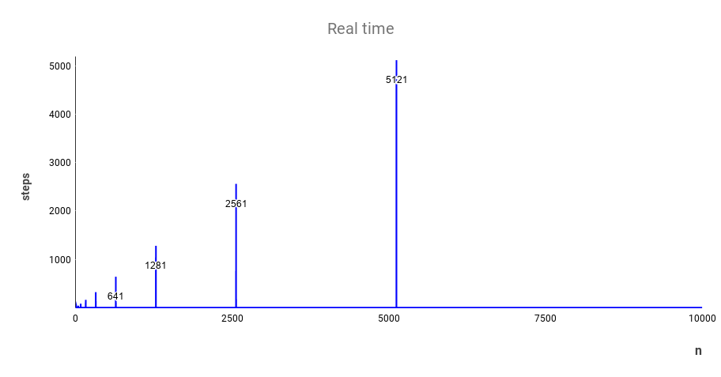
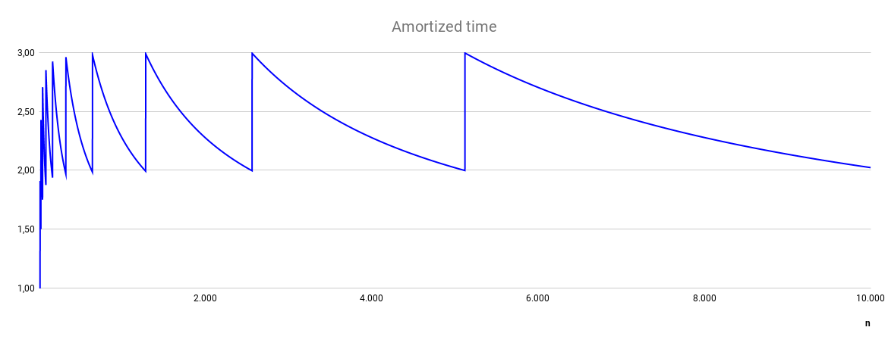

## 2020 Project 2

Εκφώνηση: https://k08.chatzi.org/projects/project2/

### Προσωπικά στοιχεία

__Όνομα__: Ντέιβιντ Μπούσι

__Α.Μ.__: sdi1900127

### Documentation

__Άσκηση 1:__

Real time complexity:

Παρατηρούμε ότι η real time πολυπλοκότητα είναι Ο(1) πάντα εκτός από όταν διπλασιάζεται το capacity του vector, όπου είναι O(n), επειδή η καλείται η realloc, που αντιγράφει τα στοιχεία στις νέες τους διευθύνσεις.

Amortized time complexity:

