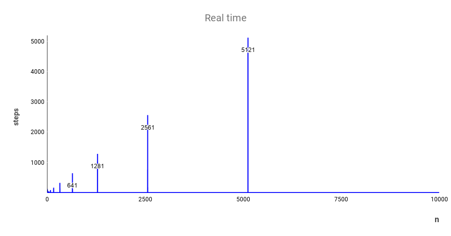
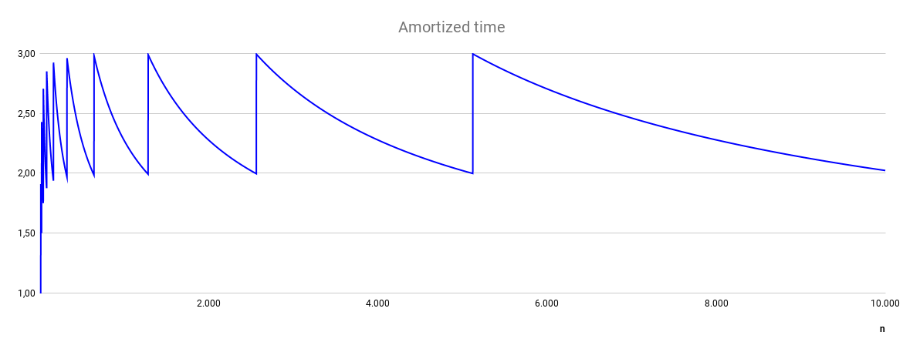
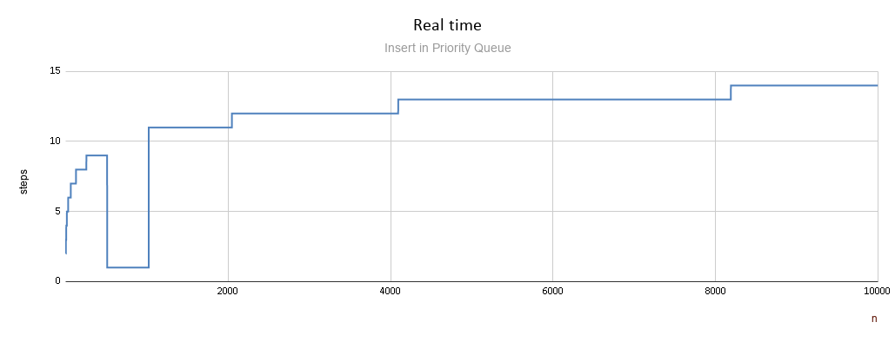
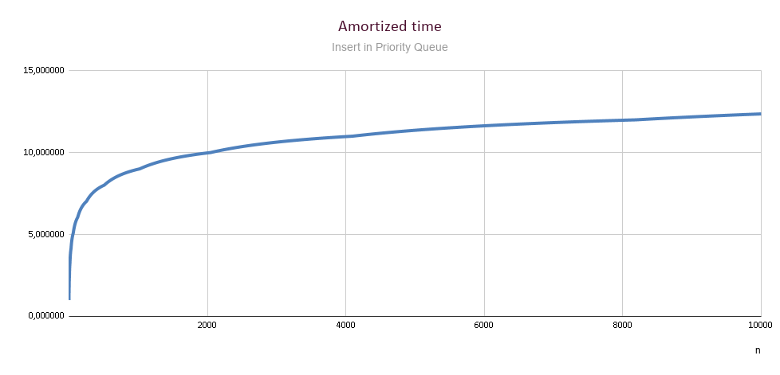

## 2020 Project 2

Εκφώνηση: https://k08.chatzi.org/projects/project2/

### Προσωπικά στοιχεία

__Όνομα__: Ντέιβιντ Μπούσι

__Α.Μ.__: sdi1900127

### Documentation
Aσκήσεις που υλοποιήθηκαν: Όλες + τα bonus των ασκήσεων 1 και 5.

__Άσκηση 1:__
Real time complexity:

Παρατηρούμε ότι η real time πολυπλοκότητα είναι Ο(1) πάντα εκτός από όταν διπλασιάζεται το capacity του vector, όπου είναι O(n), επειδή καλείται η realloc, που αντιγράφει τα υπάρχοντα στοιχεία στις νέες τους διευθύνσεις.

Amortized time complexity:

Το amortized time ξεκινάει από το 1 και πλησιάζει στο 3 και στην συνέχεια ταλαντεύεται μεταξύ του 2 και του 3, χωρίς να ξεπερνάει ποτέ το 3.

Επειδή η χείριστη πολυπλοκότητα Ο(n) παρατηρείται μόνο στον διπλασιασμό του capacity, δηλαδή ελάχιστες φορές, είναι καλύτερο να λάβουμε υπόψιν την amortized time complexity για να μελετήσουμε την πολυπλοκότητα της vector_insert_last. Αφού η τελευταία δεν ξεπερνάει το 3, μπορούμε να πούμε ότι η vector_insert_last έχει γενικά πολυπλοκότητα Ο(1).

__Bonus:__
Υλοποίηση: __Priority Queue Using Heap__

Real time complexity:

Επειδή η υλοποίηση γίνεται μέσω vector, λαμβάνονται υπόψιν και τα "βήματα" για την εισαγωγή του νέου κόμβου στο vector, εκτός των βημάτων που απαιτεί το bubble_up.
Παρατηρούμε ότι ακόμα και στα 10000 βήματα η pqueue_insert δεν ξεπερνά τα 14 βήματα. Και αυτό γιατί ο σωρός είναι *complete*, και στην χειρότερη περίπτωση (που είναι αυτή που εξετάζεται) χρειάζονται O(h) βήματα, όπου h το ύψος, όμως h <= logn στα complete δέντρα, άρα η pq_insert() είναι O(logn). Αυτό επιβεβαιώνεται και από το γράφημα. log2(10000) &asymp; 14.

Amortized time complexity:

Σε αυτό το γράφημα φαίνεται καλύτερα η λογαριθμική πολυπλοκότητα της pq_insert() στην υλοποίηση μέσω σωρού.

__Άσκηση 2:__
Στην υλοποίηση της BList προστέθηκε η συνάρτηση blist_last_inserted(), η οποία δηλώνεται στο αρχείο private_ADTBList.h. Αυτό που κάνει είναι να επιστρέφει τον πιο πρόσφατο κόμβο της λίστας, μετά από την κλήση της blist_insert(). Το ίδιο θα μπορούσε να γίνει κάνοντας return μέσω της blist_insert(), όμως αυτό θα άλλαζε την διεπαφή, που δεν επιτρέπεται. Η λειτουργία αυτή χρησιμεύει στην άσκηση 5, ώστε να παίρνουμε τον κόμβο που μόλις εισήχθη σε Ο(1).

__Άσκηση 3:__
Το ADTSet ήδη χρησιμοποιεί nodes, και επιτρέπει την προσπέλαση των στοιχείων βάση της CompareFunc. Άρα, ένα Priority Queue μπορεί να υλοποιηθεί με ένα ADTSet που επιπλέον επιτρέπει την διαγραφή ενός κόμβου που δεν είναι απαραίτητα ο πρώτος, που είναι και το ζητούμενο της άσκησης.
Με information hiding, το PriorityQueueNode είναι στην ουσία __casted SetNode__ και το PriorityQueue είναι ένα struct που περιέχει το Set με τα στοιχεία.

__Άσκηση 5:__
Γίνεται χρήση του έτοιμου ADTBList από την άσκηση 2 και της συμπληρωματικής συνάρτησης blist_last_inserted(), η οποία δηλώνεται στο αρχείο private_ADTBList.h.

*Για το bonus:*
Η υλοποίηση με την BList βρίσκεται στο `\modules\UsingBinarySearchTree\ADTSet.c`, ενώ η υλοποίηση χωρίς BList στο `\modules\UsingBinarySearchTree\ADTSet_without_BList.c`.
Για την πρώτη παράγεται το test, `UsingBinarySearchTree_ADTSet_test`, ενώ για την δεύτερη το `UsingBinarySearchTree_ADTSet_without_BList_test`.
Και οι δύο περιέχουν την `set_remove_node` προσαρμοσμένη ανάλογα την υλοποίηση, αλλά η βασική ιδέα είναι αυτή που περιγράφεται και στις διαφάνειες του μαθήματος.
* Η απλή περίπτωση: Ο node έχει μόνο ένα παιδί, το οποίο συνδέεται με τον από πάνω node, και ύστερα αφαιρείται ο κόμβος.
* Η δύσκολη περίπτωση: Ο node έχει δύο παιδιά. Ανταλλάσουμε τις τιμές του node και του επόμενου/προηγούμενου σε διάταξη κόμβου, διατηρώντας την BST ιδιότητα. Ο άλλος κόμβος θα έχει το πολύ ένα παιδί, άρα τον αφαιρούμε με την παραπάνω διαδικασία.
Για την υλοποίηση της `set_remove_node` χρειάστηκε η αποθήκευση του "γονιού" των nodes, δηλαδή του κόμβου που βρίσκεται πάνω από τον κόμβο.
